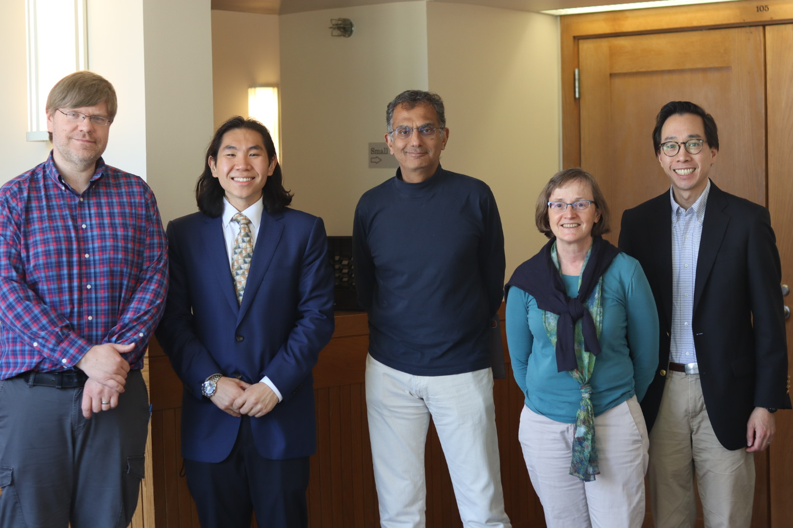

	

		
	

	 
	 
	

		Email: {{site.email}}
	

***

I am a postdoc at EPFL working with [Babak Falsafi](https://parsa.epfl.ch/~falsafi/), [PARSA](https://parsa.epfl.ch/), and [EcoCloud](https://ecocloud.epfl.ch/).

I received my PhD from Princeton University where I was advised by [Prof. David Wentzlaff](https://princeton.edu/~wentzlaf/) in the [Princeton Parallel Group](https://parallel.princeton.edu/). I was supported by Princeton's Gordon Y. S. Wu Fellowship and the NSF Graduate Research Fellowship Program. I spent summer 2023 interning at AMD Research working with Yasuko Eckert.

<!-- I did my undergrad at Duke in Electrical and Computer Engineering. I was advised by [Prof. Krishnendu Chakrabarty](https://search.asu.edu/profile/4669916) and his graduate students and conducted research on VLSI testing. -->

***

### **News**

* Sep 2025 - Started at EPFL
* May 2025 - Defended my thesis! Thank you Dave for being an incredible advisor and Sharad, Margaret, and Ben for being an awesome committee!

  

* Mar 2025 - "Chip Architectures under Advanced Computing Sanctions" accepted at ISCA 2025!
* Feb 2025 - Talk at University of Central Florida
* Jan 2025 - Talk at EPFL

***

### **Research Interests**
My research focuses on computer architecture and systems under (very broadly defined) economics constraints. I am interested in how factors such as semiconductor manufacturing, economic trends, and policies/regulations ultimately affect chip and system designs. 

Closer to traditional computer architecture, I am interested in energy and cost efficiency, chiplet architectures, software-hardware co-design ([DECADES Project](https://decades.cs.princeton.edu/)) and sys for ML ([SAIL@Princeton](https://sysml.cs.princeton.edu/index.html)).

***
<!-- authors, "title in quotes,", *conference in italics*, city, state, country, month year -->
<!-- ### **Preprints**

<ul class='no_marker'>
	<li><b>A Hardware Evaluation Framework for Large Language Model Inference</b></li>
	<li>Hengrui Zhang, August Ning, Rohan Prabhakar, and David Wentzlaff</li>
	<li>Dec 2023</li>
	<li><a href="https://arxiv.org/abs/2312.03134">[arxiv]</a> <a href="assets/papers/llm-hardware-eval-arxiv-2023.pdf">[pdf]</a></li>
</ul> -->

<!-- authors, "title in quotes,", *conference in italics*, city, state, country, month year -->
### **Publications**

<ul class='no_marker'>
	<li><b>Chip Architectures Under Advanced Computing Sanctions</b></li>
	<li>August Ning and David Wentzlaff</li>
	<li><i>The 52nd International Symposium on Computer Architecture (ISCA 2025)</i></li>
	<li><a href="https://dl.acm.org/doi/10.1145/3695053.3731012">[ACM DL]</a> <a href="assets/papers/sanctions-isca-2025.pdf">[pdf]</a></li>
</ul>

<ul class='no_marker'>
	<li><b>Computer Architecture Under Economic Constraints</b></li>
	<li>August Ning</li>
	<li><i>PhD Thesis, Princeton University</i></li>
</ul>

<ul class='no_marker'>
	<li><b>Revisiting Computation for Research: Practices and Trends</b></li>
	<li>Jeremiah Giordani*, Ziyang Xu*, <i>Et al.</i></li>
	<li><i>2024 International Conference for High Performance Computing, Networking, Storage and Analysis (SC24)</i></li>
	<li><a href="https://dl.acm.org/doi/abs/10.1109/SC41406.2024.00076">[ACM DL]</a> <a href="assets/papers/computing-trends-sc-2024.pdf">[pdf]</a></li>
</ul>

<ul class='no_marker'>
	<li><b>LLMCompass: Enabling Efficient Hardware Design for Large Language Model Inference</b></li>
	<li>Hengrui Zhang, August Ning, Rohan Prabhakar, and David Wentzlaff</li>
	<li><i>The 51th International Symposium on Computer Architecture (ISCA 2024)</i></li>
	<li><a href="https://ieeexplore.ieee.org/document/10609604">[IEEE Xplore]</a> <a href="assets/papers/llmcompass-isca-2024.pdf">[pdf]</a> <a href="https://github.com/PrincetonUniversity/llmCompass/">[Github repo]</a> <a href="https://www.youtube.com/watch?v=OlF5D0HDJTE">[Lightning talk]</a></li>
</ul>

<ul class='no_marker'>
	<li><b>CIFER: A Cache-Coherent 12nm 16mm2 SoC With Four 64-Bit RISC-V Application Cores, 18 32-Bit RISC-V Compute Cores, and a 1541 LUT6/mm2 Synthesizable eFPGA</b></li>
	<li>Ang Li, <i>Et al.</i></li>
	<li><i>IEEE Solid-State Circuits Letters</i>, Aug 2023</li>
	<li><a href="https://ieeexplore.ieee.org/document/10210635">[IEEE Xplore]</a> <a href="assets/papers/cifer-sscl-2023.pdf">[pdf]</a></li>
</ul>

<ul class='no_marker'>
	<li><b>Supply Chain Aware Computer Architecture</b></li>
	<li>August Ning, Georgios Tziantzioulis, and David Wentzlaff</li>
	<li><i>The 50th International Symposium on Computer Architecture (ISCA 2023)</i></li>
	<li><a href="https://dl.acm.org/doi/10.1145/3579371.3589052">[ACM DL Open Access]</a> <a href="assets/papers/supply-chain-isca-2023.pdf">[pdf]</a> <a href="https://github.com/PrincetonUniversity/ttm-cas/">[Github repo]</a></li>
</ul>

<ul class='no_marker'>
	<li><b>CIFER: A 12nm, 16mm2, 22-Core SoC with a 1541 LUT6/mm2, 1.92 MOPS/LUT, Fully Synthesizable, Cache-Coherent, Embedded FPGA</b></li>
	<li>Ting-Jung Chang*, Ang Li*, <i>Et al.</i></li>
	<li><i>2023 IEEE Custom Integrated Circuits Conference (CICC 2023)</i></li>
	<li><a href="https://ieeexplore.ieee.org/abstract/document/10121294">[IEEE Xplore]</a> <a href="assets/papers/cifer-cicc-2023.pdf">[pdf]</a></li>
</ul>

<ul class='no_marker'>
	<li><b>DECADES: A 67mm2, 1.46TOPS, 55 Giga Cache-Coherent 64-bit RISC-V Instructions per second, Heterogeneous Manycore SoC with 109 Tiles including Accelerators, Intelligent Storage, and eFPGA in 12nm FinFET</b></li>
	<li>Fei Gao, <i>Et al.</i></li>
	<li><i>2023 IEEE Custom Integrated Circuits Conference (CICC 2023)</i></li>
	<li><b>Best Student Paper Award Nominee!</b></li>
	<li><b>New! Nov 2024</b> <a href="https://github.com/PrincetonUniversity/stripes">[Stripes Open Source]</a> <a href="https://ieeexplore.ieee.org/document/10121257">[IEEE Xplore]</a> <a href="assets/papers/decades-cicc-2023.pdf">[pdf]</a></li>
</ul>

<ul class='no_marker'>
	<li><b>Duet: Creating Harmony between Processors and Embedded FPGAs</b></li>
	<li>Ang Li, August Ning, and David Wentzlaff</li>
	<li><i>2023 IEEE International Symposium on High-Performance Computer Architecture (HPCA 2023)</i></li>
	<li><a href="https://ieeexplore.ieee.org/document/10070989">[IEEE Xplore]</a> <a href="assets/papers/duet-hpca-2023.pdf">[pdf]</a> <a href="https://github.com/PrincetonUniversity/duet">[Github repo]</a></li>
</ul>

<ul class='no_marker'>
	<li><b>Variation-Aware Delay Fault Testing for Carbon-Nanotube FET Circuits</b></li>
	<li>Sanmitra Banerjee, Arjun Chaudhuri, August Ning and Krishnendu Chakrabarty</li>
	<li><i>IEEE Transactions on Very Large Scale Integration (VLSI) Systems</i>, Feb 2021</li>
	<li><a href="https://ieeexplore.ieee.org/document/9316977">[IEEE Xplore]</a> <a href="assets/papers/vadft-cntfet-tvlsi-2021.pdf">[pdf]</a></li>
</ul>

### **Workshops/Presentations**

<ul class='no_marker'>
	<li><b>Computer Architectures for Chip Surplus</b></li>
	<li>August Ning and David Wentzlaff</li>
	<li><i>ACM Student Research Competition at MICRO 2022</i>, Oct 2022</li>
	<li><a href="assets/papers/chip-surplus-src-micro-2022.pdf">[poster]</a></li>
</ul>

<ul class='no_marker'>
	<li><b>Supply Chain Aware Chip Architecture</b></li>
	<li>August Ning, Georgios Tziantzioulis, and David Wentzlaff</li>
	<li><i>The Fourth Young Architect Workshop at ASPLOS 2022</i>, Mar 2022</li>
	<li><a href="assets/papers/supply-chain-yarch-asplos-2022.pdf">[poster]</a></li>
</ul>

---

Additionally, I am passionate about building research and student communities. I serve on the [Computer Architecture Student Association](https://sigarch.org/casa/) steering committee and I was the graduate liason for [Princeton ACM](https://princetonacm.github.io/). I was also a resident graduate student at [Whitman College](https://whitmancollege.princeton.edu/). If you're ever in the area or meet me at a conference, please reach out and say hello!

---

[Linkedin](https://linkedin.com/in/{{ site.linkedin }}) / [Twitter](https://twitter.com/{{ site.twitter }}) / [Github](https://github.com/{{ site.github }}) / [Google Scholar](https://scholar.google.com/citations?user={{ site.google_scholar }}) / [DBLP](https://dblp.org/pid/284/6904.html) 
/ [ORCID](https://orcid.org/0000-0002-3331-7958) / [CV]({{ site.cv_filepath }})

This website is built with [Jekyll](https://github.com/jekyll/jekyll) using a modified [no style, please!](https://github.com/riggraz/no-style-please) theme.